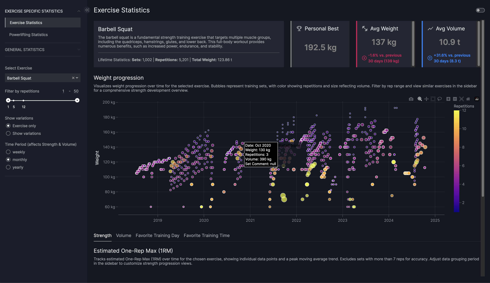
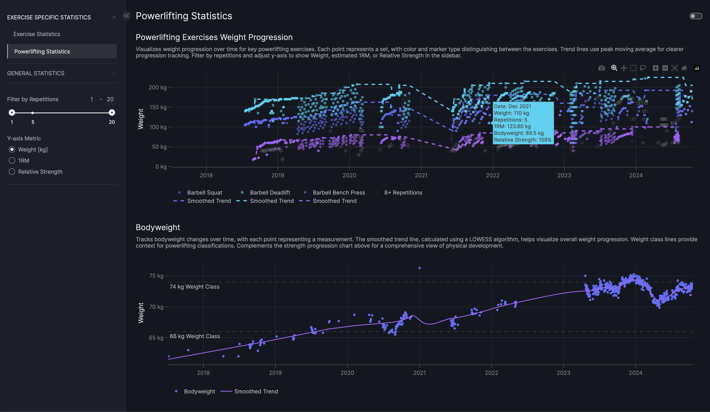
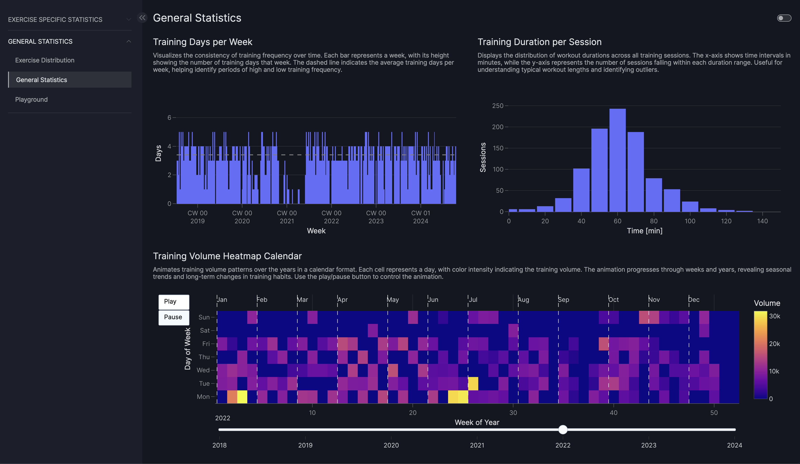

# Fitness Data Dashboard


A comprehensive dashboard for analyzing and visualizing my personal fitness data using Plotly Dash.

## Table of Contents
- [Fitness Data Dashboard](#fitness-data-dashboard)
  - [Table of Contents](#table-of-contents)
  - [About](#about)
  - [Features](#features)
  - [Installation](#installation)
  - [Usage](#usage)
  - [Screenshots](#screenshots)


## About

This project is a Plotly Dash application that processes and visualizes fitness data from various sources, including workout logs and body weight measurements. It provides interactive visualizations and statistics to help gain insights into my fitness journey.

## Features

- Integration of data from multiple fitness tracking apps
- Interactive visualizations of workout progress
- Body weight trend analysis
- Exercise-specific statistics and performance metrics

## Installation

This project uses the `uv` package manager. Follow these steps to set up the project:

1. Install `uv` if you haven't already. You can use one of the following methods:

   - On macOS and Linux:
     ```
     curl -LsSf https://astral.sh/uv/install.sh | sh
     ```

   - On Windows:
     ```
     powershell -ExecutionPolicy ByPass -c "irm https://astral.sh/uv/install.ps1 | iex"
     ```

   - With pip:
     ```
     pip install uv
     ```

   For more installation options, see the [uv installation documentation](https://docs.astral.sh/uv/getting-started/installation/).

2. Clone the repository:
   ```
   git clone https://github.com/FSaal/fitness-journey.git
   cd fitness-data-dashboard
   ```

3. Create a virtual environment and install dependencies:
   ```
   uv venv
   ```

4. Activate the virtual environment:
   - On Unix or MacOS:
     ```
     source .venv/bin/activate
     ```
   - On Windows:
     ```
     .venv\Scripts\activate
     ```

5. Install dependencies:
   ```
   uv sync
   ```

## Usage

1. Ensure your virtual environment is activated.

2. Run the Dash application:
```
python app_vizro.py
```

3. Open a web browser and navigate to `http://localhost:8050` to view the dashboard.

## Screenshots

Here are some screenshots of the dashboard in action:


*Exercise Statistics Page*


*Powerlifting Statistics Page*


*General Statistics Page*


